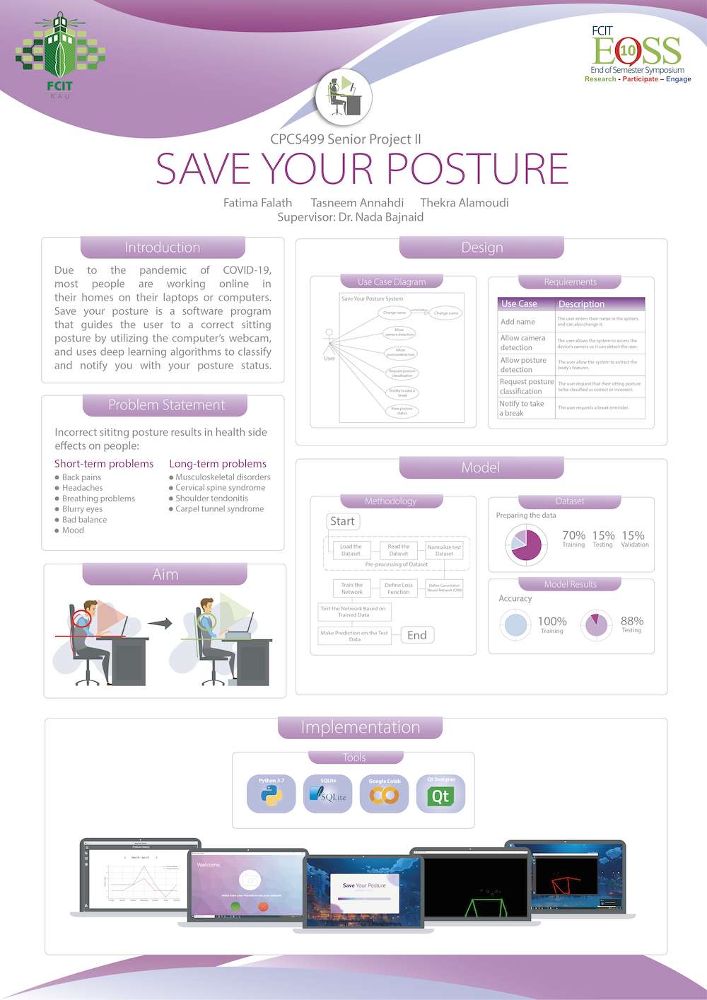

# Save your Posture Model

The save your posture model takes images of people sitting in front of the webcam and classifies their sitting posture into correct or incorrect. 
It uses the python library Posenet in addition to other libraries such as OpenCV and tensorflow to create the classifier. 
The output of this model was used in the Save your Posture desktop application. 

